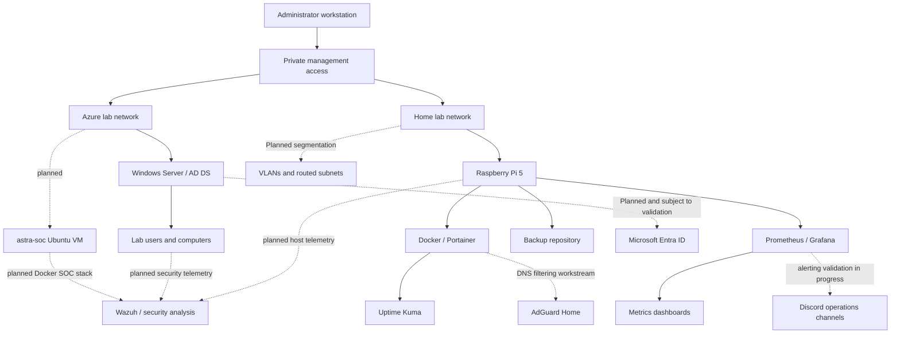

# Astra Infrastructure Lab

A personal infrastructure engineering lab covering Windows Server, Active Directory, Microsoft Azure, networking, Linux, containers, monitoring, automation, security operations and operational troubleshooting.

**Status:** Active learning project. This repository is a documentation-first portfolio, not a production deployment package. Some exercises have been completed in the lab, while others are planned or still require validation. The distinction is recorded below.

## Purpose

The aim is to develop practical infrastructure skills by building services, understanding their dependencies, applying security controls, validating changes and documenting recovery and troubleshooting. The lab provides a controlled environment for learning enterprise-style administration without using employer infrastructure.

## Portfolio overview

| Workstream | Current evidence-based status | Learning focus |
| --- | --- | --- |
| Windows Server & AD DS | Lab server deployed; domain administration and delegated-account exercises completed | Identity, DNS, OUs, security groups and permissions |
| Group Policy | Multiple policies configured; USB restriction/exception and shared-drive exercises undertaken | Policy scope, filtering, testing and rollback |
| Service accounts | Dedicated account/group and scheduled-task exercise completed and validated | Least privilege and non-interactive logon |
| Azure | Windows Server VM and supporting cloud networking used for lab administration | Compute, virtual networking, access and cost awareness |
| Raspberry Pi | Pi 5, Docker, Portainer and Tailscale configured; remote access validated | Linux, containers and private remote administration |
| Monitoring | Prometheus/Grafana monitoring added alongside Uptime Kuma; host dashboard work completed, with alerting and controlled-outage validation still in progress | Metrics, dashboards, availability, alerting and incident response |
| Backup | Scheduled backup, retention dry run and isolated test-file restore recorded; integrity and application recovery outstanding | Backup design, retention and restore verification |
| Discord automation | Astra server structure successfully bootstrapped with a reusable Python/JSON tool; generic version retained under `tools/` | Automation, configuration-as-code concepts, permissions and repeatability |
| Astra SOC | Architecture and Azure design documented; implementation not yet claimed | SIEM/XDR, security telemetry, containerised services and incident investigation |
| Infrastructure as code | Bicep-first Astra SOC deployment planned and workspace created | Azure Bicep, parameterisation, modularity, validation and repeatable deployment |
| Entra synchronisation | Planned; no completed end-to-end hybrid identity validation claimed | Identity lifecycle and hybrid architecture |
| VLAN segmentation | Planned; not claimed as implemented on the home network | Routing, switching and trust boundaries |

These are summaries of previous lab exercises, not a claim that the entire environment is currently online or that all components have passed production acceptance testing. Screenshots and test results will be added only after they have been reviewed and sanitised.

## Latest portfolio milestone — September 2026

Recorded evidence covers a successful scheduled encrypted Restic backup to Azure, a retention dry run with no deletions, and an isolated disposable-file restore verified by matching SHA-256 hashes and byte comparison. These results demonstrate backup execution and recovery of the selected test file, not complete application recovery. See the [9 September backup and recovery evidence](evidence/2026-09-09-raspberry-pi-backup-recovery.md).

The read-only AD inventory script also has [six passing local mocked Pester tests recorded on 8 September](evidence/2026-09-08-ad-inventory-unit-tests.md). Live AD execution and CI success remain separate, unverified claims.

A reusable [Discord Server Bootstrapper](tools/discord-server-bootstrapper/README.md) has now been added after successfully completing the Astra server-structure build. It uses a JSON layout, local `.env` secrets, preview/apply modes, explicit confirmation and non-destructive reruns. See the [Discord bootstrapper evidence note](evidence/2026-09-09-discord-server-bootstrapper.md).

The [Astra SOC workstream](docs/soc/README.md) now documents the planned hybrid SOC architecture, dedicated Azure Ubuntu host and phased validation approach. Its first Infrastructure-as-Code exercise will provision the `astra-soc` foundation using Azure Bicep; no SOC deployment is yet claimed as implemented.

**Next milestone:** complete alert routing and perform a bounded outage of one disposable container, documenting healthy → down → recovered monitoring states, detection delay, rollback and lessons learned. In parallel, begin the Bicep foundation for `astra-soc`. No essential service or remote-access dependency should be stopped. Repository integrity and application-level restore validation remain outstanding.

See the [detailed evidence checklist and controlled outage plan](evidence/portfolio-evidence-checklist.md) for completed evidence, remaining checks, safety gates and acceptance criteria.

## Reference architecture

The diagram below is an illustrative portfolio design, not a copy of my actual network. It uses fictional names and addresses. Only the relationships documented as completed should be treated as implemented.



See [Architecture](docs/architecture.md) for trust boundaries, dependencies and the lab-only addressing example. See [Astra SOC](docs/soc/README.md) for the planned security-monitoring architecture.

## Repository structure

```text
astra-infrastructure-lab/
├── README.md
├── SECURITY.md
├── .gitignore
├── docs/
│   ├── architecture.md
│   ├── active-directory.md
│   ├── operations.md
│   ├── raspberry-pi-operations.md
│   ├── validation.md
│   ├── roadmap.md
│   └── soc/
│       ├── README.md
│       ├── 02-azure-design.md
│       └── 03-build-plan.md
├── infrastructure/
│   └── azure/
│       └── astra-soc/
│           └── README.md
├── scripts/
│   ├── README.md
│   └── Get-AstraADHealth.ps1
├── tests/
│   └── Get-AstraADHealth.Tests.ps1
├── tools/
│   └── discord-server-bootstrapper/
│       ├── README.md
│       ├── setup.py
│       ├── layout.py
│       ├── layout.json
│       ├── requirements.txt
│       └── tests/
├── evidence/
│   ├── README.md
│   ├── 2026-09-08-ad-inventory-unit-tests.md
│   ├── 2026-09-09-raspberry-pi-backup-recovery.md
│   ├── 2026-09-09-discord-server-bootstrapper.md
│   └── portfolio-evidence-checklist.md
└── examples/
    └── README.md
```

This repository intentionally does not contain live deployment secrets, actual AD exports, production policies, private DNS records or real backup archives. Future scripts and infrastructure-as-code examples will be added only after review and lab validation.

## What the project demonstrates

The emphasis is on infrastructure engineering rather than simply installing products. Each workstream should demonstrate requirements, design choices, implementation, security considerations, evidence of testing, failure handling and lessons learned.

The [Active Directory](docs/active-directory.md) notes record identity and policy exercises. [Operations](docs/operations.md) covers monitoring, backup and recovery. [Validation](docs/validation.md) defines how results are recorded without inventing test outcomes. The [Roadmap](docs/roadmap.md) separates completed work from the next stages of learning. The [Astra SOC](docs/soc/README.md) workstream extends the lab into security monitoring and will use the [Astra SOC Bicep workspace](infrastructure/azure/astra-soc/README.md) as the first focused Azure Infrastructure-as-Code project. The [Discord Server Bootstrapper](tools/discord-server-bootstrapper/README.md) provides a reusable automation example for configuration-driven service setup.

## First practical automation example

The [read-only AD inventory script](scripts/README.md) provides a concrete, reviewable starting point for PowerShell automation. It collects domain, forest and domain-controller metadata, supports optional replication-failure queries, and includes mocked Pester tests. It does not change directory objects or write files unless a local report path is explicitly supplied. Six local mocked tests are [recorded as passed](evidence/2026-09-08-ad-inventory-unit-tests.md); live-lab execution and CI success are not yet verified.

## Getting started

This is not a one-command deployment. Begin with the reference architecture and select a single workstream. Use isolated lab infrastructure, take a suitable snapshot or backup, and follow the relevant official product documentation. Replace every example hostname, domain and IP address with values appropriate to your own authorised lab.

For Windows Server work, start with a disposable VM and a lab-only directory. For Linux work, use a separate test VM or Pi where a mistake cannot interrupt essential home services. Never paste example commands into an employer environment or expose management services to the public internet.

## Related projects

- [Entra Dynamic Group Rule Builder](https://github.com/localhostjohn/Entra-Dynamic-Group-Rule-Builder)
- [AZ-104 Sprint](https://github.com/localhostjohn/az-104-sprint)
- [Astra DNS Blocklist](https://github.com/localhostjohn/astra-blocklist)
- [Ethical Hacking Command Reference](https://github.com/localhostjohn/ethical-hacking-command-reference)

## References

- [Microsoft Learn: Windows Server](https://learn.microsoft.com/windows-server/)
- [Microsoft Learn: Active Directory Domain Services](https://learn.microsoft.com/windows-server/identity/ad-ds/)
- [Microsoft Learn: Azure](https://learn.microsoft.com/azure/)
- [Microsoft Learn: Microsoft Entra](https://learn.microsoft.com/entra/)
- [Docker documentation](https://docs.docker.com/)
- [Tailscale documentation](https://tailscale.com/kb/)
- [Prometheus documentation](https://prometheus.io/docs/)
- [Grafana documentation](https://grafana.com/docs/)
- [Restic documentation](https://restic.readthedocs.io/)

## Security and publication

See [SECURITY.md](SECURITY.md). All public examples are based on personal lab environments or fictional data. Employer infrastructure, internal configuration, credentials and confidential information are not published here.

Maintained by John Weekes as a personal learning portfolio. The repository is not affiliated with or endorsed by the vendors whose products are referenced.
