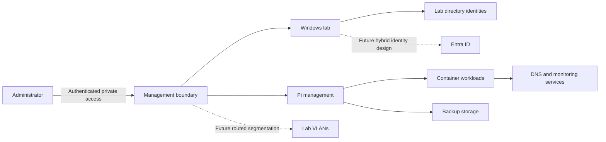

# Reference Architecture

## Scope and assumptions

This document describes an illustrative infrastructure lab. It is not a live network inventory, and its addresses, hostnames and domain are fictional. The Windows and Pi workstreams have been developed through separate lab exercises; their integration must not be assumed to be complete.

## Example addressing

| Segment | Example range | Purpose | Status |
| --- | --- | --- | --- |
| Management | `192.0.2.0/27` | Administrative access | Reference design only |
| Servers | `192.0.2.32/27` | Directory and application servers | Reference design only |
| Clients | `192.0.2.64/26` | Lab workstations | Reference design only |
| Container services | `192.0.2.128/27` | Linux/container workloads | Reference design only |
| Lab directory | `ad.astra.example.test` | Illustrative AD DNS namespace | Fictional |

The `192.0.2.0/24` range is reserved for documentation and must not be copied into a real routing design. Allocate actual non-overlapping RFC1918 ranges when implementing an isolated network. Do not reuse an existing home or enterprise subnet without checking for conflicts.

## Identity and management

A Windows Server lab provides AD DS and DNS services for directory administration exercises. Normal user identities, privileged accounts and service accounts should have separate purposes and permissions. Administrative access is limited to authorised management paths; standard users should not receive domain-wide privileges.

The cloud VM is part of a personal Azure lab. An eventual connection to Microsoft Entra ID is a separate, planned workstream requiring verified DNS, identity scope, synchronisation prerequisites, licensing and rollback considerations. No completed hybrid synchronisation is asserted here.

## Linux and container services

The Raspberry Pi workstream includes Docker, Portainer, Tailscale and Uptime Kuma. Tailscale is installed on the host, providing a private remote-access path. Container management interfaces should remain accessible only through appropriately restricted management networks or private access controls. Publishing a port is not the same as authorising access; both host/network filtering and application authentication must be considered.

DNS filtering and backup services are separate workstreams. The existence of a blocklist or backup snapshot does not establish that DNS filtering is active for every device or that full disaster recovery has been tested.

## Trust boundaries

The intended control model is least privilege, separate administrative identities, management-plane restrictions, encryption for remote access, and explicit authorisation before enabling network exposure. Segmentation is a planned learning outcome, not a claim that an existing home router or switch currently enforces these boundaries.

## Dependencies and failure domains

- Directory services depend on reliable DNS, time synchronisation and suitable connectivity.
- A cloud-based directory service may be unavailable to local clients during an internet or VPN outage; clients and services must be designed with that dependency in mind.
- Container services depend on host storage, networking, Docker and their individual application data.
- DNS filtering can disrupt normal browsing if upstream DNS or blocklist policy is misconfigured.
- Monitoring must not be mistaken for a backup, and a backup must not be mistaken for a tested recovery plan.

## Planned validation

Record the actual topology in a private inventory. Test DNS and directory resolution, management access, GPO application, service-account permissions, container health, monitoring alerts and backup restoration as independent exercises. Recreate public diagrams using role-based hostnames and documentation-only addressing rather than publishing a screenshot of the real infrastructure.
