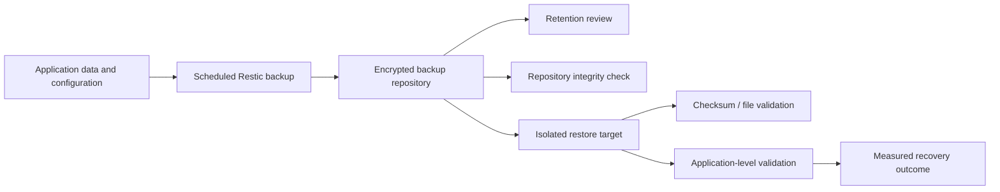

# Backup and Recovery Engineering

## Purpose

This workstream turns the Astra backup work into a repeatable infrastructure engineering exercise. It separates four controls that are often incorrectly treated as the same thing:

1. **Backup execution** — did the scheduled job create a usable snapshot?
2. **Retention** — does the policy select the expected snapshots without unintended deletion?
3. **Repository integrity** — can Restic validate the repository structure and data?
4. **Recovery** — can selected data or a service actually be restored and validated?

A successful result in one area does not automatically prove the others.

## Current evidence-based status

| Control | Status | Evidence |
| --- | --- | --- |
| Scheduled encrypted backup | **Passed — 9 September 2026** | Scheduled Restic job completed and a snapshot was saved |
| Retention policy dry run | **Passed — 9 September 2026** | Policy evaluated successfully; no snapshots were deleted |
| Isolated disposable-file restore | **Passed — 9 September 2026** | Restored file matched the original by SHA-256 and byte comparison |
| Repository integrity check | **Outstanding** | Configuration/timer reviewed; successful check result not yet recorded |
| Application-level recovery | **Outstanding** | No complete application restore is claimed |
| Measured RPO/RTO | **Outstanding** | Define targets before the application-level recovery exercise |

The dated source record is [Raspberry Pi Backup and Recovery Validation](../evidence/2026-09-09-raspberry-pi-backup-recovery.md).

## Recovery architecture



The diagram is conceptual. Repository endpoints, credentials, live paths and private infrastructure details are intentionally excluded.

## Recovery maturity stages

### Stage A — file-level recovery

Restore a disposable file into a separate location and compare it with the source.

**Astra status:** Completed for one disposable test file on 9 September 2026.

This proves recovery of that selected dataset only.

### Stage B — repository integrity

Run the configured repository check and record the actual exit result, date, duration and limitations.

**Astra status:** Outstanding.

Do not describe an enabled timer or reviewed script as a successful repository check.

### Stage C — application-level recovery

Select a non-essential application with clearly identified configuration and persistent data. Restore it into an isolated instance or disposable host rather than overwriting the live service.

Validation should include:

- required files and configuration are present;
- ownership and permissions are correct;
- the application starts;
- the expected endpoint responds;
- key application behaviour works;
- monitoring sees the recovered service;
- elapsed recovery time is recorded.

**Astra status:** Outstanding.

### Stage D — recovery objectives

Before the application recovery exercise, define:

- **RPO (Recovery Point Objective):** maximum acceptable data loss measured in time;
- **RTO (Recovery Time Objective):** target time to restore the selected service.

After the exercise, compare the measured result with the targets. Do not invent enterprise-grade objectives for a personal lab merely to make the project look more advanced.

## Disposable restore drill

The repository includes [Run-AstraResticRestoreDrill.sh](../scripts/Run-AstraResticRestoreDrill.sh).

The script creates:

- a temporary working directory;
- known disposable files;
- a new temporary Restic repository;
- a temporary repository password;
- source SHA-256 checksums;
- an isolated restore target.

It then:

1. initialises the temporary repository;
2. backs up the disposable dataset;
3. runs `restic check`;
4. removes the disposable source copy;
5. restores the latest snapshot into an isolated location;
6. compares restored checksums with the originals;
7. deletes the temporary workspace on exit.

It does **not** connect to the real Astra repository, change retention, delete real snapshots or restore over live application data.

Run only on an authorised Linux host:

```bash
chmod +x scripts/Run-AstraResticRestoreDrill.sh
./scripts/Run-AstraResticRestoreDrill.sh
```

A passing disposable drill demonstrates that the scripted test worked on that host. It is not evidence that the live Azure-backed repository or any particular application is recoverable.

## Live recovery safety gates

Before a live-lab recovery test:

- identify the exact snapshot and restore scope privately;
- confirm recovery credentials are available without publishing them;
- confirm adequate free storage;
- restore to a new path or isolated host;
- do not overwrite live Docker volumes on the first attempt;
- identify application dependencies before recovery;
- preserve raw logs privately if they contain sensitive infrastructure metadata;
- publish only sanitised evidence;
- stop the exercise if it risks DNS, remote access, backup services or another household dependency.

## Evidence standard

Use [backup-restore-evidence-template.md](../evidence/backup-restore-evidence-template.md) for subsequent exercises.

A portfolio recovery claim should contain:

- objective and scope;
- preconditions;
- expected and actual result;
- relevant software versions;
- timestamps;
- validation method;
- problems encountered;
- corrective action;
- limitations;
- lessons learned.

Failures are useful evidence when they are recorded accurately.

## Security boundaries

Never commit:

- Restic passwords or password files;
- Azure Storage credentials or SAS tokens;
- private repository URLs;
- raw snapshot listings containing sensitive paths;
- real user files;
- SSH private keys;
- Tailscale authentication material;
- employer infrastructure details.

Backup metadata should be treated as sensitive even when backup contents are encrypted.

## Next practical milestone

Complete and record **PI-07 repository integrity**. After that, define an RPO and RTO for one low-risk containerised service and design an isolated application-level recovery exercise.
