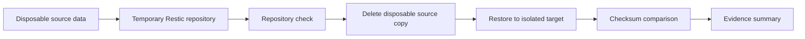

# Backup and Recovery Workstream

## Purpose

This workstream demonstrates backup engineering as an operational capability rather than treating a successful backup command as proof of recoverability.

The goals are to:

- document backup design and recovery assumptions;
- validate that a repository can be checked before recovery;
- restore disposable data into an isolated location;
- verify restored content using checksums;
- record recovery evidence without publishing real backup data or credentials;
- separate a repeatable lab drill from the live Raspberry Pi backup configuration.

## Current status

The Astra Raspberry Pi lab has previously been used to practise Restic snapshots, retention and scheduled backup activity. The public repository does **not** contain the live repository location, backup password, cloud credentials, private hostnames or backup archives.

A complete restore against the live Raspberry Pi backup repository is not claimed here.

The script in `../scripts/Run-AstraResticRestoreDrill.sh` is a separate, disposable recovery exercise. It creates its own temporary Restic repository and test data so the recovery process can be practised without modifying the real backup environment.

## Recovery design



The drill intentionally separates the source, repository and restore destination. A first recovery test should never overwrite live application data.

## Validation sequence

1. Confirm that `restic` and a SHA-256 checksum utility are available.
2. Create a temporary working directory.
3. Generate known disposable test files.
4. Calculate and store source checksums.
5. Initialise a new temporary Restic repository.
6. Back up the disposable source data.
7. Run `restic check`.
8. Remove the disposable source copy to simulate loss.
9. Restore the latest snapshot into a separate recovery location.
10. Calculate restored checksums and compare them with the originals.
11. Report success only if repository validation and checksum comparison both succeed.
12. Remove the temporary working directory when the script exits.

## Running the disposable drill

Run this only on a Linux host that you own or are authorised to administer.

```bash
chmod +x scripts/Run-AstraResticRestoreDrill.sh
./scripts/Run-AstraResticRestoreDrill.sh
```

The script does not require the password for the real Astra backup repository. It generates a temporary password file inside the disposable workspace and removes the entire workspace on exit.

A successful script run demonstrates the mechanics of a Restic backup, repository check and file-level restore in an isolated exercise. It does **not** prove that the real Raspberry Pi backup repository, every Docker volume or every application can be recovered.

## Live-lab recovery checklist

Before performing a recovery test against a real repository:

- confirm the exact repository and snapshot intended for recovery;
- verify backup credentials using a private mechanism;
- run a repository integrity check appropriate to the environment;
- identify dependencies such as Docker versions, bind mounts, databases and service configuration;
- restore to a new directory or disposable host first;
- validate file ownership and permissions as well as file contents;
- perform application-specific validation before declaring the service recovered;
- record recovery time and any manual dependencies;
- sanitise evidence before publication.

## Recovery objectives

For later live-lab exercises, record two operational measures:

**Recovery Point Objective (RPO)** — the maximum acceptable amount of data that could be lost, expressed as time since the most recent usable backup.

**Recovery Time Objective (RTO)** — the target time required to restore the service or data to an acceptable operating state.

No RPO or RTO is claimed for the current Astra lab until a timed live-lab recovery exercise has been completed.

## Evidence

Use `../evidence/backup-restore-evidence-template.md` to document a real or disposable exercise. Do not alter the template to imply that a test passed unless the commands were actually run and the evidence was reviewed.

## Security considerations

Never commit:

- Restic passwords or password files;
- repository credentials or cloud access keys;
- private endpoint names;
- unredacted snapshot listings;
- real user files;
- SSH keys or Tailscale credentials;
- raw infrastructure exports containing private addresses or identifiers.

A backup repository should be treated as sensitive even when its data is encrypted because repository metadata may still reveal operational information.

## Next validation milestone

Run the disposable recovery drill on an isolated Linux host and record its result. After that, design a controlled restore of non-sensitive data from the real Astra backup repository into a separate path without overwriting live services.
