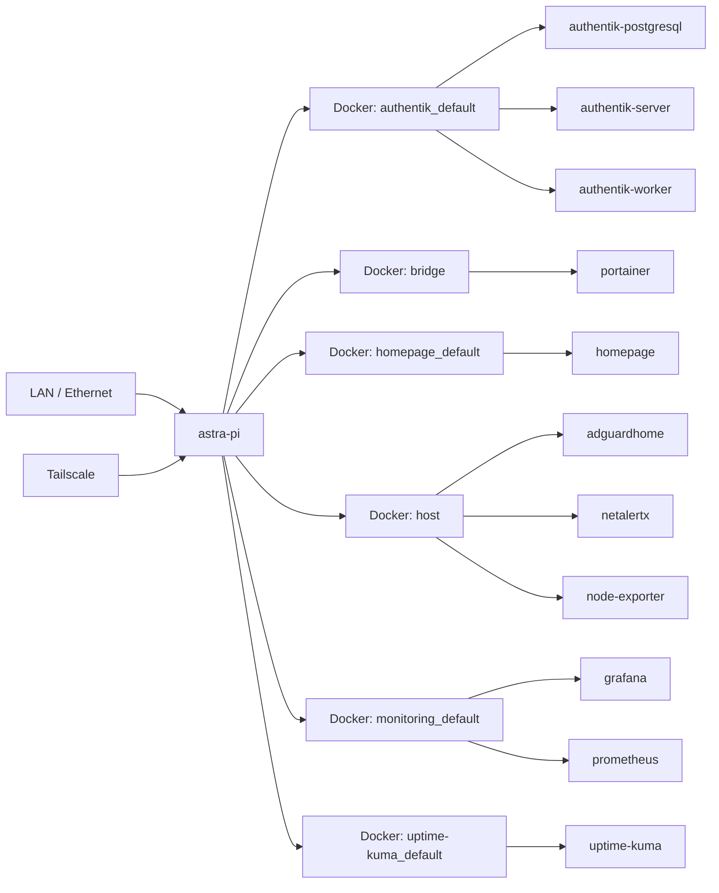

# Astra Raspberry Pi — Generated Topology

> Generated from the sanitised v0.3 discovery model. Connections shown are Docker network memberships observed by the collector.

Only observed Docker network membership is represented; application-level dependencies are not inferred.
