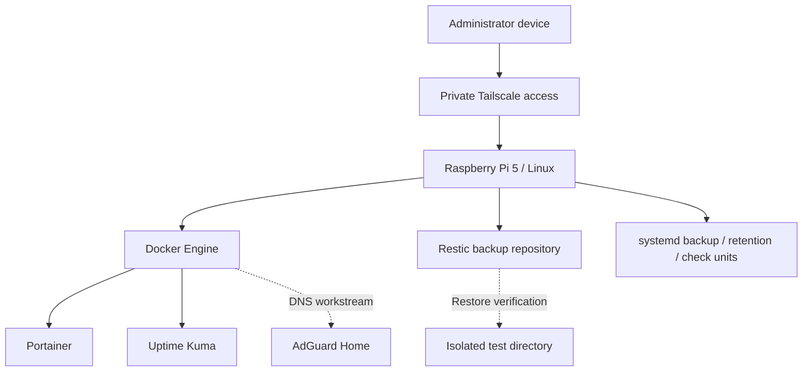

# Raspberry Pi Operations and Recovery

## Purpose and status

This workstream documents practical Linux and infrastructure operations on the personal Astra Raspberry Pi 5. It is a learning record, not a complete deployment package or a claim that every service is currently healthy. The existing [operations overview](operations.md) covers the broader principles; this page provides a more focused Pi runbook and evidence plan.

The lab has included Docker, Portainer, Uptime Kuma, host-installed Tailscale, private remote access and Restic backup work. AdGuard Home has been prepared and a custom blocklist developed, but a fully validated network-wide DNS deployment is not claimed. Backup scheduling, retention and repository-check exercises have also been undertaken. Their current configuration, execution history and recovery results still need to be verified before publication.

## Illustrative service architecture

This diagram is a conceptual representation using fictional labels. It is not an export of the actual home network.



The arrows do not imply that all components are currently running or that every path has been tested. In particular, the restore path remains to be evidenced.

## Read-only baseline collection

Run the following commands only on your own Pi. They inspect the current state and do not install packages, restart services, change firewall rules or modify network settings. Review output privately before sharing it; it can contain real hostnames, addresses, mounts and service details.

```bash
hostnamectl
cat /etc/os-release
uname -r
uptime
ip -br address
ip route

docker version
docker ps --format 'table {{.Names}}\t{{.Image}}\t{{.Status}}\t{{.Ports}}'

df -h
lsblk -f

systemctl list-timers --all --no-pager
systemctl status docker --no-pager
systemctl status tailscaled --no-pager
```

For the existing Astra backup workstream, inspect the unit definitions before assuming that a timer is operating correctly:

```bash
systemctl cat astra-backup.service astra-backup.timer
systemctl cat astra-retention.service astra-retention.timer
systemctl cat astra-repository-check.service astra-repository-check.timer
```

If a unit has a different name or is not installed, record that rather than creating or changing it during evidence collection. Service definitions and status output may expose private paths, environment-file locations, repository endpoints or command arguments. Do not publish raw output.

## Evidence register

| Evidence ID | Check | Expected evidence | Status |
| --- | --- | --- | --- |
| PI-01 | Host and OS baseline | Sanitised hardware/OS summary | Pending current verification |
| PI-02 | Docker and application inventory | Reviewed service list and image versions | Pending current verification |
| PI-03 | Private management access | Access-path diagram and controlled connectivity test | Pending current verification |
| PI-04 | Monitoring | Defined checks and a controlled alert test | Pending current verification |
| PI-05 | Backup scheduling | Reviewed unit definitions and actual execution history | Pending current verification |
| PI-06 | Retention | Dry-run and approved retention outcome | Pending current verification |
| PI-07 | Repository integrity | Actual repository-check result | Pending current verification |
| PI-08 | Recovery | Isolated restore and checksum comparison | Not yet evidenced |

Historical setup and test notes are useful context, but they do not replace current validation. Record the date, software version, check performed, expected outcome, actual result and any corrective action for each exercise.

## Backup and recovery approach

Treat backup, retention, repository integrity and restore as separate controls. A successful timer start is not proof that data was backed up; a successful snapshot is not proof that it can be restored; and a repository integrity check is not a substitute for an application-consistent recovery test.

For the first recovery exercise, use disposable files and a separate empty restore directory. Do not restore over live Docker volumes or application data. Confirm the repository and snapshot selection privately, preserve encryption/recovery credentials, compare the restored files with the originals and record the result. Avoid publishing repository URLs, credentials, actual file inventories or backup archives.

Before changing retention, confirm the repository, snapshot scope and policy. Review a dry run first and never copy destructive `forget`, `prune` or deletion commands from a portfolio example into a live service without checking their effects.

## Security and publication boundaries

Keep Tailscale authentication material, private DNS names, home addresses, actual IP ranges, SSH keys, tokens, `.env` files and backup credentials out of Git. Use documentation-only addresses and recreated diagrams. Do not expose Portainer, Uptime Kuma or other management interfaces publicly merely to demonstrate the project. Record only the minimum evidence needed to show the engineering decision and result.

## Next practical exercise

Collect the read-only baseline, review the existing backup unit definitions and inspect the latest execution history privately. Then select a disposable dataset for a non-destructive restore test. Only after the restore has actually passed should the evidence register be updated to show recovery validation.

## References

- [Docker Engine documentation](https://docs.docker.com/engine/)
- [Tailscale documentation](https://tailscale.com/kb/)
- [systemd timers](https://www.freedesktop.org/software/systemd/man/latest/systemd.timer.html)
- [Restic documentation](https://restic.readthedocs.io/)
- [Uptime Kuma](https://github.com/louislam/uptime-kuma)
