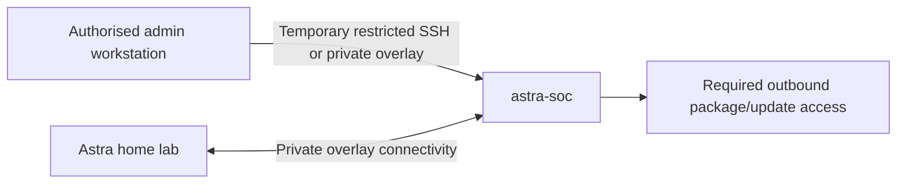

# Astra SOC Azure Design

## Objective

Create a dedicated Azure-hosted Ubuntu VM named `astra-soc` for the resource-intensive security components of the Astra Infrastructure Lab while keeping lightweight, always-on services on the Raspberry Pi.

## Proposed resource layout

```text
rg-astra-soc
├── vnet-astra-soc
│   └── snet-security
├── nsg-astra-soc
├── nic-astra-soc
└── astra-soc
```

The exact resource names and addressing will remain parameterised in Bicep so the deployment can be recreated without embedding environment-specific values.

## Initial VM profile

| Setting | Proposed value |
| --- | --- |
| Hostname | `astra-soc` |
| Operating system | Ubuntu Server 24.04 LTS Gen2 |
| Architecture | x64 |
| VM family | General purpose |
| Target size | 4 vCPU with at least 8 GiB RAM; 16 GiB preferred for lab headroom |
| OS disk | 128 GiB Standard SSD initially |
| Authentication | SSH public key |
| Password authentication | Disabled |
| Trusted Launch | Enabled where supported |
| Secure Boot | Enabled where supported |
| vTPM | Enabled where supported |

The final VM SKU should be checked against current Azure regional availability and cost before deployment.

## Network design

The SOC host should use a dedicated subnet and Network Security Group. Public exposure should be kept to the minimum required for initial provisioning.



### Intended controls

- Do not expose Wazuh dashboard, API, enrollment or agent ports broadly to the internet.
- If a temporary public SSH rule is required during bootstrap, restrict the source to an explicitly supplied administrator IP and remove it after private connectivity is confirmed.
- Use Tailscale or another approved private management path for routine administration.
- Keep network rules parameterised and documented.
- Do not commit a real public IP address to the repository.

## Security boundary

`astra-soc` is treated as a dedicated security workload rather than a general-purpose server. Administrative access should be limited, SSH password authentication disabled, the operating system patched, and container services bound only where required.

Secrets must not be stored in Bicep source or parameter example files. Authentication material should be supplied securely at deployment time or through an appropriate secret-management mechanism.

## Cost controls

This is a learning environment, not a production SOC. Cost controls should include:

- Reviewing the selected VM SKU before each deployment
- Using Standard SSD storage unless performance testing demonstrates a need for more
- Configuring Azure auto-shutdown during build/testing phases
- Deallocating the VM when prolonged monitoring is not required
- Documenting teardown commands and resource-group deletion

The project should not claim an always-on monitoring capability while the VM is intentionally deallocated for cost control.

## Infrastructure as code

The Azure resources will be defined under:

```text
infrastructure/azure/astra-soc/
```

The first Bicep iteration should remain intentionally small:

1. Virtual network and security subnet
2. Network Security Group
3. Network interface
4. Ubuntu VM
5. SSH public-key authentication
6. Outputs required for validation

Additional components should be added only after the base deployment has been validated.

## Validation criteria

The Azure foundation can be marked implemented after deployment, but should only be marked validated once the following have been demonstrated:

- Resource group and expected resources are present
- VM reports a healthy running state
- SSH works using the authorised key
- Password authentication is not required
- Network rules match the intended design
- Private connectivity is established before broad public management access is removed
- Re-deployment from Bicep is repeatable
- A documented teardown removes the disposable Azure resources cleanly

Evidence should be sanitised before publication.
