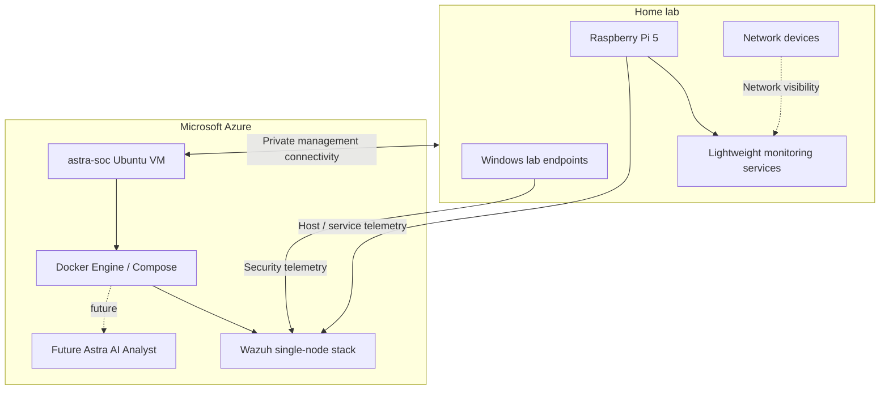

# Astra SOC

Astra SOC is the security-monitoring workstream of the Astra Infrastructure Lab. It is designed as a small hybrid lab that separates lightweight home-lab services from heavier SIEM and security-analysis workloads.

## Purpose

The project is intended to develop practical infrastructure and security operations skills through an isolated, authorised lab. The focus is on architecture, deployment, monitoring, validation, recovery and documentation rather than simply installing security products.

## Planned architecture

The diagram is illustrative. No deployment should be considered complete until it has been implemented and validated in the lab.

## Design principles

- Keep the Raspberry Pi focused on lightweight, always-on infrastructure services.
- Host Wazuh and other resource-intensive SOC components on a dedicated Ubuntu VM.
- Use Docker and Docker Compose where appropriate for repeatability and isolation.
- Use Azure Bicep to define the cloud infrastructure as code.
- Prefer private management connectivity over public exposure.
- Do not expose Wazuh management services directly to the public internet.
- Record validation evidence separately from planned work.
- Use fictional Astra identities, systems and data in all public documentation.
- Never store passwords, private keys, tokens or environment-specific secrets in the repository.

## Planned components

| Component | Proposed role | Planned location | Status |
| --- | --- | --- | --- |
| `astra-soc` | Dedicated Ubuntu SOC host | Azure | Planned |
| Docker Engine / Compose | Container runtime | `astra-soc` | Planned |
| Wazuh Manager | Agent/event management | `astra-soc` | Planned |
| Wazuh Indexer | Security-event indexing | `astra-soc` | Planned |
| Wazuh Dashboard | Security operations interface | `astra-soc` | Planned |
| Tailscale | Private management connectivity | Home lab + Azure | Planned for SOC path |
| NetAlertX | Network discovery/visibility | Raspberry Pi | Planned |
| Grafana / Prometheus | Infrastructure observability | Raspberry Pi / lab | Existing workstream; SOC integration planned |
| Astra AI Analyst | Alert summarisation/correlation experiment | `astra-soc` | Future |

## Delivery stages

1. Document the architecture and security boundaries.
2. Define `astra-soc` infrastructure using Bicep.
3. Deploy and harden the Ubuntu VM.
4. Establish private management connectivity.
5. Install Docker and validate persistent storage.
6. Deploy the Wazuh single-node container stack.
7. Add authorised Astra Windows/Linux endpoints.
8. Generate controlled test events.
9. Record detection and recovery evidence.
10. Add alert routing and AI-assisted analysis only after the base platform is stable.

## Validation approach

The repository will distinguish between **planned**, **implemented**, and **validated** states. A component will only be described as validated when suitable evidence has been captured and sanitised.

Example controlled tests may include:

- Failed authentication attempts
- Account lockout
- Creation of a disposable local administrator
- PowerShell execution in a test endpoint
- Stopping and restarting a disposable service
- Approved network scanning inside the lab
- Detection of a newly introduced lab device

Tests must remain within systems owned by or explicitly authorised for the Astra lab.

## Related documents

- [Azure design](02-azure-design.md)
- [Build plan](03-build-plan.md)
- [Infrastructure-as-code workspace](../../infrastructure/azure/astra-soc/README.md)
- [Main infrastructure roadmap](../roadmap.md)

## Publication safety

Astra SOC is a public portfolio project. Screenshots, configuration exports and logs must be reviewed before publication. Do not publish employer infrastructure details, real credentials, Azure subscription identifiers, private IP allowlists, SSH keys, Tailscale auth keys, Wazuh passwords or other secrets.
